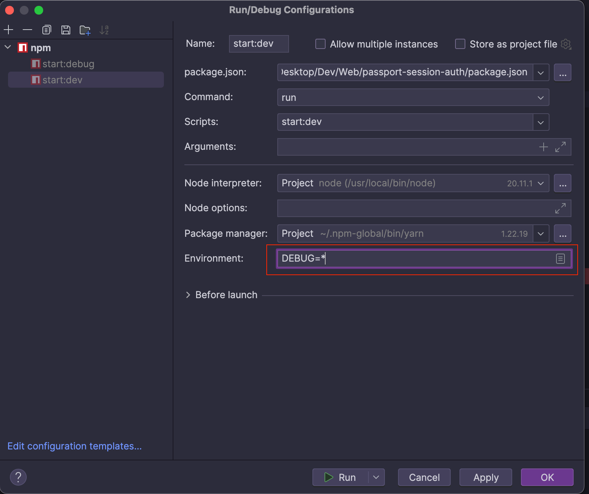

<p align="center">
  <a href="http://nestjs.com/" target="blank"></a>
</p>

## Description

Session-based authentication with [NestJS](https://github.com/nestjs/nest) and [PassportJS](https://www.passportjs.org/)

Use [file-session-store](https://github.com/valery-barysok/session-file-store) and [redis-session-store](https://github.com/tj/connect-redis)

See: https://github.com/pnlinh-it/nestjs-session-based-auth/pulls/1

## Reference
- https://dev.to/nestjs/setting-up-sessions-with-nestjs-passport-and-redis-210

## Installation

```bash
$ yarn install
```

Allow express DEBUG log



Or update package.json by add `DEBUG=*` before script
```json
{
  "scripts": {
    "start:dev": "DEBUG=* nest start --watch",
    "start:debug": "DEBUG=* nest start --debug --watch",
  }
}

```

## How `express-session` work
- Get encrypt session id (`connect.sid`) from cookie from Header: https://github.com/expressjs/session/blob/master/index.js#L537
- Use HMAC to validate cookie from request: https://github.com/tj/node-cookie-signature/blob/master/index.js
- Decrypt above session id to get real session id: https://github.com/expressjs/session/blob/master/index.js#L550
- The real session id is file name of JSON file that store in `./sessions` if we use session-file-store. Such as: `mJD_7Ucj0THEWi-ZKSlmcOziuGICWWUK.json`
- Assign session id to `req.sessionId`: https://github.com/expressjs/session/blob/master/index.js#L221
- Then get session id content from store: https://github.com/expressjs/session/blob/master/index.js#L493

## The content of session file

```json
{
  "cookie": {
    "originalMaxAge": 60000,
    "expires": "2024-05-18T09:58:03.463Z",
    "httpOnly": true,
    "path": "/",
    "sameSite": true
  },
  // When we call request.login in local.guard.ts
  // Passport will save this value to session
  // https://github.com/jaredhanson/passport/blob/master/lib/sessionmanager.js#L44
  "passport": {
    "user": {
      "id": 1,
      "name": "Linh"
    }
  },
  "__lastAccess": 1716026223463
}
```

When we call `request.login` in `local.guard.ts`, Passport will save `passport.user` into to session: https://github.com/jaredhanson/passport/blob/master/lib/sessionmanager.js#L44


## What happen when we send a request to `/login` endpoint
* Invoke `LocalGuard#canActive`
* Invoke `passport.authenticate` in [`auth.guard.ts`](https://github.com/nestjs/passport/blob/master/lib/auth.guard.ts#L116)
* Get username and password from request: https://github.com/jaredhanson/passport-local/blob/master/lib/strategy.js#L97
* Invoke `LocalStrategy#validate` to obtain user from username & password
* Invoke `LocalGuard#loginUser`


## Running the app

```bash
# development
$ yarn run start

# watch mode
$ yarn run start:dev

# production mode
$ yarn run start:prod
```

